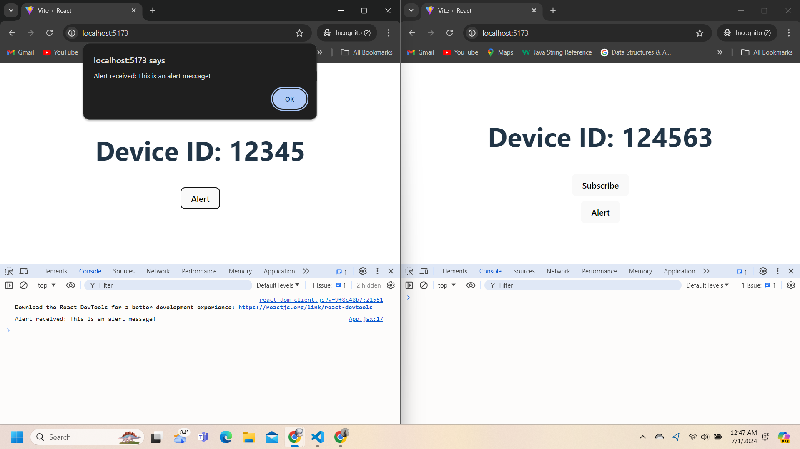
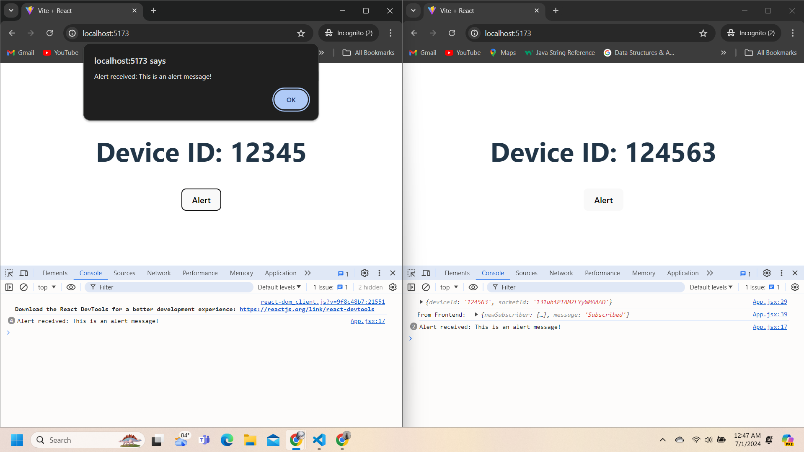
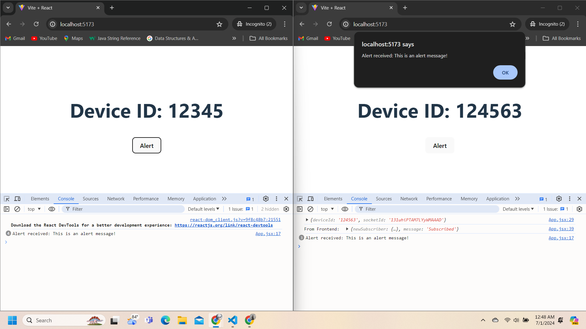

# Device Subscription and Alert System

This project is a Device Subscription and Alert System built with React, Node.js, Express, MongoDB, and Socket.io. It allows devices to subscribe with their device ID and receive real-time alerts via WebSocket.

## Features

- **Subscribe a device**: Devices can subscribe using their device ID.
- **Real-time Alerts**: Send alerts to all subscribed devices in real-time.
- **Socket.io Integration**: Utilizes WebSocket for real-time communication.

## Prerequisites

- Node.js (>=12.0.0)
- npm (>=6.0.0) or yarn (>=1.0.0)
- MongoDB (>=4.0)

## Getting Started

### Backend Setup

1. **Clone the repository**

   ```bash
   https://github.com/Bibhavshah/push-notifications-with-scoket.git
   cd your-repo-name/backend



